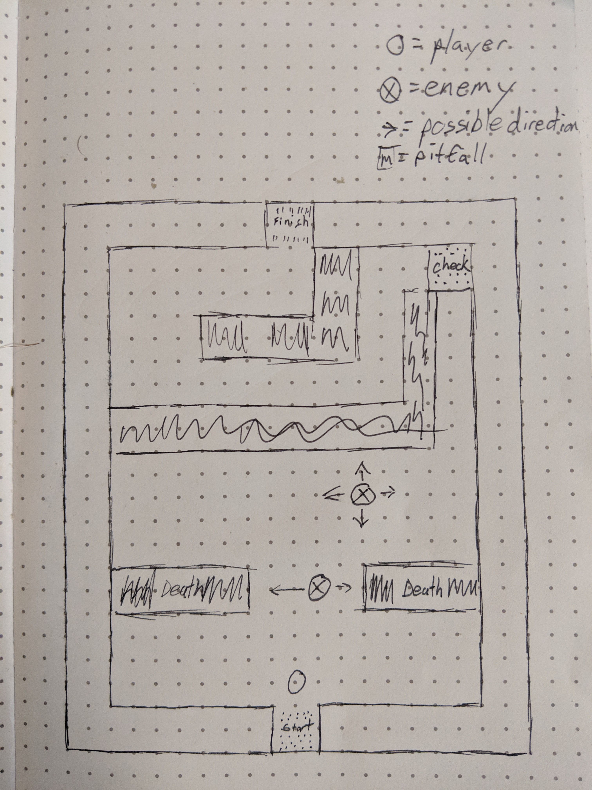

# Project-1

##User stories

### MVP
* User clicks start for game to begin
* when user presses direction key character moves 1 block on the grid in that direction
* if user presses direction key towards a wall block, character will not move to block on grid
* User sees enemies move
* if caracter is in same block as an enemy, character dies
* if character is in same block as pit, character dies
* if character is in same block as door win

### NTH

* if character is in same block as key item, move key item to inventory
* if user presses direction key towards a door block and character does not have key item, character will not move to block on grid
* if user presses direction key towards a door block and character does have key item, character will move to block on grid
* if character gets past door, go to next level.
* User sees enemies move faster

### Stretch

* character faces direction of last direction keypress
* User presses Z key for character to pick up key/ open doors in block in front of them
* User presses space to attack enemies 3 blocks forward
* enemies move towards character.
* enemies attack 2 blocks forward if character is in range

